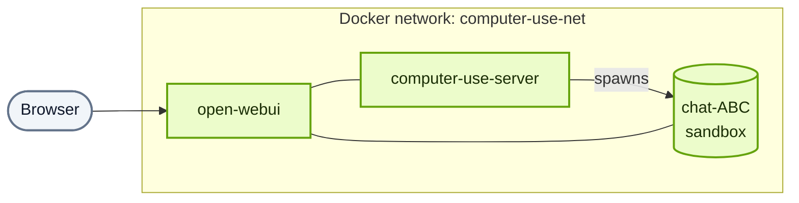

## Two compose files

| File | Runs | Purpose |
|---|---|---|
| `docker-compose.yml` | `computer-use-server`, Postgres | The MCP orchestrator; talks to the Docker socket to spawn per-chat sandbox containers. |
| `docker-compose.webui.yml` | `open-webui` (patched), `watchtower` | Open WebUI, built from `openwebui/Dockerfile` with the Computer Use patches applied. |

Both attach to the same external Docker network (`computer-use-net`) that the server creates on first `up`, so the Open WebUI container can reach `computer-use-server:8081` without DNS gymnastics.

## Sandbox image layout

The `open-computer-use:latest` image uses a multi-stage build for layer caching:

1. **base** — environment variables
2. **system-packages** — 108 APT packages (LibreOffice, Java 21, ffmpeg, ImageMagick, Tesseract, fonts, ...)
3. **python-deps** — 107 Python packages (python-docx, python-pptx, openpyxl, pypdf, Pillow, OpenCV, pandas, playwright, ...)
4. **node-deps** — 21 Node packages (TypeScript, pdf-lib, mermaid-cli, marked, ...)
5. **playwright-setup** — Chromium
6. **final** — directory structure + permissions

Image size: **~11 GB**. First build: **~15 minutes**. Subsequent rebuilds hit Docker's layer cache.

## Mounts inside each sandbox

| Host path | Container path | Mode | Purpose |
|---|---|---|---|
| `./data/uploads/{chat_id}` | `/mnt/user-data/uploads` | read-only | User uploads for this chat |
| `./data/outputs/{chat_id}` | `/mnt/user-data/outputs` | read-write | Files the model writes; served via `/files/{chat_id}/...` |
| `./skills` | `/mnt/skills` | read-only | Built-in skills |
| chat-scoped Docker volume | `/home/assistant` | read-write | Per-chat workspace; survives container restarts until GC |

Files the model creates under `/mnt/user-data/outputs/...` get public URLs — no extra upload step.

## Lifecycle

1. Request arrives with `X-Chat-Id: ABC`.
2. Server checks for container `chat-ABC`:
   - If present, reuses it.
   - If not, creates it from `DOCKER_IMAGE`, writes `/home/assistant/README.md` with the system prompt, mounts skills and data volumes.
3. Tool call runs inside the container.
4. After `CONTAINER_MAX_AGE_HOURS` of idleness, the cleanup cron GCs the container; the workspace volume survives for `DATA_MAX_AGE_DAYS`.

Container resurrection: saved metadata lets the server recreate a GC'd container with the same volumes, env, and MCP config.

## Docker socket

`computer-use-server` needs `/var/run/docker.sock` mounted so it can create and manage sandboxes. This gives the container **effective root on the host** — treat the Docker network as privileged and put a reverse proxy / auth in front of `8081`.

## Networking

The sandbox is **not** on the public network. Everything external flows through `computer-use-server`.

## Resource limits

Per-sandbox defaults (change in `.env`):

| Limit | Default | Env var |
|---|---|---|
| Memory | 2 GB | `CONTAINER_MEM_LIMIT` |
| CPU | 1.0 | `CONTAINER_CPU_LIMIT` |

These are ceilings, not allocations — idle containers use very little. Chromium + LibreOffice can push against the ceiling.

## Security flags

- `--security-opt=no-new-privileges:true`
- Non-root user with passwordless sudo inside the sandbox
- Read-only skill and upload mounts

See [Comparison](/reference/comparison) for how isolation compares to alternatives.

## See also

- [Configuration](/install/configuration) — every env var
- [Known bugs](/reference/known-bugs) — multi-user file auth caveats
