Yambr is a managed deployment of Open Computer Use. Four public services, each with a distinct job:

| Service | URL | What it is | Who calls it |
|---|---|---|---|
| **Dashboard** | [app.yambr.com](https://app.yambr.com/) | Web app for sign-in, approvals, API keys, live spend tracking | You (in the browser) |
| **MCP endpoint** | [api.yambr.com](https://api.yambr.com) | Public MCP tool server at `/mcp/computer_use`. **No `chat/completions` — tool traffic only.** | Your agent host, any MCP client |
| **Hosted chat** | [chat.yambr.com](https://chat.yambr.com/) | Open WebUI with Computer Use pre-installed and models pre-configured | You (in the browser) |
| **Artifact host** | [cu.yambr.com](https://cu.yambr.com/) | Public file/preview URLs for artifacts created in the sandbox | Any browser (URL is the token) |

<Warning>
**Yambr publishes MCP only.** `api.yambr.com` is not an LLM gateway. `/chat/completions`, `/completions`, `/embeddings` are closed. Your LLM traffic goes to your own provider (OpenAI, Anthropic, a self-hosted LiteLLM, ...); your Yambr key unlocks the Computer Use tools.
</Warning>

## How they talk to each other

```mermaid
flowchart LR
    browser([Browser])
    host([Your agent host])
    provider([Your LLM provider<br/>OpenAI / Anthropic / …])
    chat[chat.yambr.com<br/>Hosted Open WebUI]
    api[api.yambr.com<br/>MCP endpoint<br/>/mcp/computer_use]
    cu[(cu.yambr.com<br/>Sandbox containers<br/>+ artifact host)]

    browser -- sign in --> chat
    host -- chat.completions --> provider
    host -- MCP tool calls<br/>Bearer Yambr key --> api
    chat -- MCP tool calls --> api
    api -- orchestrates --> cu
    cu -. public /files/&#123;chat_id&#125;/…<br/>preview iframes .-> browser

    classDef service fill:#ECFCCB,stroke:#65A30D,stroke-width:2px,color:#1A2E05;
    classDef client fill:#F1F5F9,stroke:#64748B,color:#0F172A;
    classDef ext fill:#FEF9C3,stroke:#CA8A04,color:#422006;
    class chat,api,cu service;
    class browser,host client;
    class provider ext;
```

<Note>
**`cu.yambr.com` is not an MCP endpoint.** It hosts sandboxes and serves artifact URLs. The public MCP endpoint is `https://api.yambr.com/mcp/computer_use` — call that with your Yambr key. See [cu.yambr.com](/platform/cu-endpoint).
</Note>

## When to use what

<CardGroup cols={2}>
  <Card title="API keys" icon="key" href="/platform/api-keys">
    Sign in with GitHub/Google, get approved, manage up to five keys with live spend.
  </Card>
  <Card title="LiteLLM gateway" icon="plug" href="/platform/litellm">
    The MCP endpoint — `https://api.yambr.com/mcp/computer_use`. Three ways to wire it in.
  </Card>
  <Card title="Hosted chat" icon="comments" href="/platform/hosted-chat">
    `chat.yambr.com` — no-setup Open WebUI with Computer Use, models ready to go.
  </Card>
  <Card title="cu.yambr.com" icon="globe" href="/platform/cu-endpoint">
    Sandbox containers and public artifact URLs.
  </Card>
  <Card title="Access model" icon="lock" href="/platform/access-model">
    Why MCP-only, and how bring-your-own-model actually works.
  </Card>
  <Card title="Dashboard tour" icon="gauge" href="/platform/dashboard">
    Walk-through of every screen at app.yambr.com.
  </Card>
</CardGroup>

## Managed vs self-hosted

| | Managed (Yambr) | Self-hosted |
|---|---|---|
| Where it runs | `*.yambr.com` | Your Docker host |
| How you get access | Key from [app.yambr.com](https://app.yambr.com/) after OAuth + approval | Clone repo, `docker compose up` |
| Cost | $10 / 30-day default budget; per-key `max_budget` | Infra cost only |
| Model provider | **Bring your own** (OpenAI, Anthropic, LiteLLM-self-hosted, …) | Bring your own `OPENAI_API_KEY` in `.env` |
| Public surface | MCP only (`api.yambr.com/mcp/computer_use`) + chat.yambr.com + artifacts | Full HTTP API on `localhost:8081` — you control auth |
| File URLs | `https://cu.yambr.com/files/...` | `http://localhost:8081/files/...` |
| Updates | Automatic | `git pull && docker compose build` |
| Good for | Fastest start, most teams | Air-gapped, custom skills, full control |

See [Self-hosting quickstart](/install/quickstart) for the DIY path.
