Yambr is a managed deployment of Open Computer Use. Four public services, each with a distinct job:

| Service | URL | What it is | Who calls it |
|---|---|---|---|
| **Dashboard** | [app.yambr.com](https://app.yambr.com/) | Web app for accounts, billing, API keys, usage | You (in the browser) |
| **LiteLLM gateway** | [api.yambr.com](https://api.yambr.com) | OpenAI-compatible API gateway in front of every supported model **and** the Computer Use MCP endpoint | Your code, any OpenAI SDK |
| **Hosted chat** | [chat.yambr.com](https://chat.yambr.com/) | Open WebUI with Computer Use pre-installed | You (in the browser) |
| **Computer Use endpoint** | [cu.yambr.com](https://cu.yambr.com/) | Live MCP server + public file/preview host | LiteLLM gateway (never direct) |

## How they talk to each other

```mermaid
flowchart LR
    browser([Browser])
    code([Your code])
    chat[chat.yambr.com<br/>Hosted Open WebUI]
    api[api.yambr.com<br/>LiteLLM gateway]
    cu[(cu.yambr.com<br/>Computer Use Server<br/>+ sandbox containers)]

    browser -- sign in --> chat
    code -- OpenAI-compatible<br/>API key --> api
    chat -- MCP tool calls --> api
    api -- proxied MCP --> cu
    cu -. public /files/&#123;chat_id&#125;/…<br/>preview iframes .-> browser

    classDef service fill:#ECFCCB,stroke:#65A30D,stroke-width:2px,color:#1A2E05;
    classDef client fill:#F1F5F9,stroke:#64748B,color:#0F172A;
    class chat,api,cu service;
    class browser,code client;
```

<Note>
**`cu.yambr.com` is not a public MCP endpoint.** You cannot hit `https://cu.yambr.com/mcp` directly from your own code. Computer Use tools are reached **only** through the LiteLLM gateway at `api.yambr.com`, using the API key from the dashboard. The `cu.yambr.com` hostname is used exclusively for the hosted MCP traffic that the gateway proxies and for **public artifact URLs** (files the model creates in its sandbox get preview links under `cu.yambr.com/files/...`).
</Note>

## When to use what

<CardGroup cols={2}>
  <Card title="API keys" icon="key" href="/platform/api-keys">
    Create, rotate, and scope keys in the dashboard.
  </Card>
  <Card title="LiteLLM gateway" icon="plug" href="/platform/litellm">
    OpenAI-compatible endpoint — `api.yambr.com`. How to call models and invoke Computer Use tools.
  </Card>
  <Card title="Hosted chat" icon="comments" href="/platform/hosted-chat">
    `chat.yambr.com` — no-setup Open WebUI with Computer Use.
  </Card>
  <Card title="cu.yambr.com" icon="globe" href="/platform/cu-endpoint">
    Why it's internal-only, and how artifact URLs work.
  </Card>
</CardGroup>

## Managed vs self-hosted

| | Managed (Yambr) | Self-hosted |
|---|---|---|
| Where it runs | `*.yambr.com` | Your Docker host |
| How you get access | API key from [app.yambr.com](https://app.yambr.com/) | Clone repo, `docker compose up` |
| Cost | Usage-based | Infra cost only |
| Model provider | Bundled (OpenAI, Anthropic, etc. via LiteLLM) | Bring your own `OPENAI_API_KEY` |
| MCP endpoint | `api.yambr.com` (behind gateway) | `http://localhost:8081/mcp` |
| File URLs | `https://cu.yambr.com/files/...` | `http://localhost:8081/files/...` |
| Updates | Automatic | `git pull && docker compose build` |
| Good for | Fastest start, production teams | Air-gapped, custom skills, full control |

See [Self-hosting quickstart](/install/quickstart) for the DIY path.
